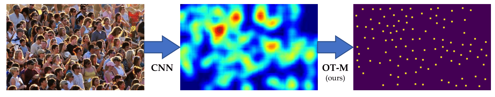

# Optimal Transport Minimization
Official code for CVPR-2023 paper "[Optimal Transport Minimization: Crowd Localization on Density Maps for Semi-Supervised Counting](https://openaccess.thecvf.com/content/CVPR2023/html/Lin_Optimal_Transport_Minimization_Crowd_Localization_on_Density_Maps_for_Semi-Supervised_CVPR_2023_paper.html)"


- [Jun-21-2023] Update the OT-M algorithm and corresponding demo (`demo.ipynb`).
- The semi-supervised counting framework is preparing. I will release it as soon as possible.

# OT-M for Localization



OT-M algorithm is presented in the `otm.py`. The demo is shown in `demo.ipynb`:
```python
from otm import den2seq
den2seq(denmap, scale_factor=8, max_itern=16, ot_scaling=0.75)
```
- `denmap` is the density map with the shape of [H, W];
- `scale_factor` means the resolution ratio of image and density map (here it is 8 since the density map is 1/8 of input image);
- `max_itern` means the maximum numper of OT and M step;
- `ot_scaling` controls the step number of Sinkhorn algorithm, it is a value in (0, 1). `ot_scaling`$\rightarrow 1$ results in more iterations in OT step.


# Citation
```
@InProceedings{Lin_2023_CVPR,
    author    = {Lin, Wei and Chan, Antoni B.},
    title     = {Optimal Transport Minimization: Crowd Localization on Density Maps for Semi-Supervised Counting},
    booktitle = {Proceedings of the IEEE/CVF Conference on Computer Vision and Pattern Recognition (CVPR)},
    month     = {June},
    year      = {2023},
    pages     = {21663-21673}
}
```
